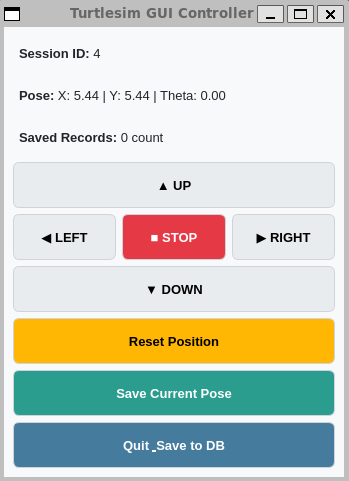

# ROS 2 Turtlesim PyQt5 GUI Controller & Pose Logger

A ROS 2 (Humble) package that provides a PyQt5 Graphical User Interface (GUI) to control the `turtlesim` node, monitor real-time pose data, and persist movement histories into a MySQL database.

---

## 📌 Features

* **GUI Motion Control**: PyQt5 buttons to publish velocity commands (`/turtle1/cmd_vel`) for moving forward, backward, turning, and stopping.
* **Real-time Pose Tracking**: Subscribes to `/turtle1/pose` topic and displays real-time X, Y, Theta coordinates on the GUI.
* **Synchronized Teleport & Reset**: Teleports the turtle back to initial coordinates (`5.44, 5.44`) via `/turtle1/teleport_absolute` and clears background traces using `/clear` via async callbacks.
* **Database Persistence**: Stores active session logs and turtle movement coordinates into a MySQL database upon saving or quitting the application.

---

## 🖥️ GUI Overview & Control Layout



### Status Display
* **Session ID**: Displays the current active session ID linked with the MySQL database.
* **Pose**: Real-time position tracking (`X`, `Y`, `Theta`) updated directly from `/turtle1/pose`.
* **Saved Records**: Indicates the total count of pose snapshots currently buffered in memory.

### Control Buttons & Functions
* **▲ UP**: Publishes positive linear velocity to move the turtle forward.
* **▼ DOWN**: Publishes negative linear velocity to move the turtle backward.
* **◀ LEFT**: Publishes positive angular velocity to rotate the turtle counter-clockwise.
* **▶ RIGHT**: Publishes negative angular velocity to rotate the turtle clockwise.
* **■ STOP**: Publishes zero velocity to immediately stop turtle movement.
* **Reset Position**: Teleports the turtle back to default coordinates (`5.44, 5.44, 0.00`) and clears background pen traces sequentially.
* **Save Current Pose**: Takes a snapshot of current coordinates and buffers it into memory.
* **Quit_Save to DB**: Saves all buffered pose records to the MySQL database and safely terminates the application.

---

## 🛠 Prerequisites & Dependencies

* **OS**: Ubuntu 22.04 LTS (WSL2 supported)
* **ROS 2 Version**: ROS 2 Humble
* **Python**: 3.10+
* **Database**: MySQL Server (Host/WSL network accessible)

### Python Package Installation
```bash
pip3 install pymysql
```

---

## ⚙️ Configuration & Database Setup

### 1. Database Connection Setting
Edit `practice_pkg/db_helper.py` to set up your MySQL connection info:

```python
DB_CONFIG = dict(
    host: '172.29.192.1',  # Replace with your Windows Host IP (check via `$ ip route show | grep default | awk '{print $3}'`)
    user: 'root',
    password: 'YOUR_PASSWORD',
    database: 'rosdb',
    charset="utf8mb4"
)
```

### 2. Grant External Access (If using Windows Host MySQL)
Run the following SQL commands on your Windows MySQL server to allow access from WSL:

```sql
CREATE USER IF NOT EXISTS 'root'@'%' IDENTIFIED BY 'YOUR_PASSWORD';
GRANT ALL PRIVILEGES ON *.* TO 'root'@'%' WITH GRANT OPTION;
FLUSH PRIVILEGES;

CREATE DATABASE IF NOT EXISTS rosdb;
```

---

## 🚀 Installation & Build

1. **Clone the Repository** (inside your ROS 2 workspace `src` directory):
   ```bash
   cd ~/ros2_study/src
   git clone [https://github.com/jeongseonarm/ros-turtle-control.git](https://github.com/jeongseonarm/ros-turtle-control.git) practice_pkg
   ```

2. **Build the Package**:
   ```bash
   cd ~/ros2_study
   colcon build --packages-select practice_pkg
   source install/setup.bash
   ```

---

## 💻 How to Run

Open two separate terminal windows (or tabs) and execute the following commands in order:

1. **Terminal 1: Start Turtlesim Node**
   ```bash
   ros2 run turtlesim turtlesim_node
   ```

2. **Terminal 2: Launch PyQt5 GUI Controller**
   ```bash
   cd ~/ros2_study
   source install/setup.bash
   ros2 run practice_pkg turtle_gui
   ```

---

## 📂 Package Structure

```text
practice_pkg/
├── practice_pkg/
│   ├── __init__.py
│   ├── app.py           # Main application entry point
│   ├── db_helper.py     # MySQL database helper class
│   ├── main_window.py   # PyQt5 GUI interface & logic
│   └── turtle_node.py   # ROS 2 Node (Publisher, Subscriber, Service Clients)
├── resource/
│   └── practice_pkg
├── package.xml          # ROS 2 package dependencies
├── setup.cfg
└── setup.py             # Build & entry point definitions
```
